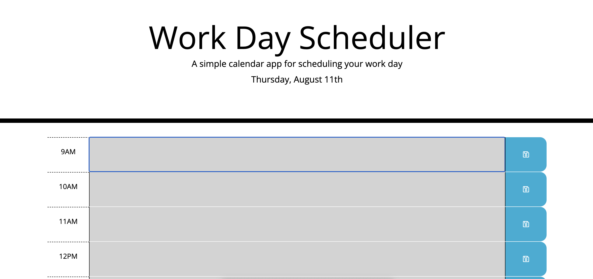

# Work-Day-Calendar

# Description 
Create workday calendar that allows user to add in tasks that need to be done during the workday hours of 9am-5pm. Once user puts in the task info it should save it to local storage so when the page is refreshed the task info is still there. 

# Application 
https://raenique27.github.io/Work-Day-Calendar/

